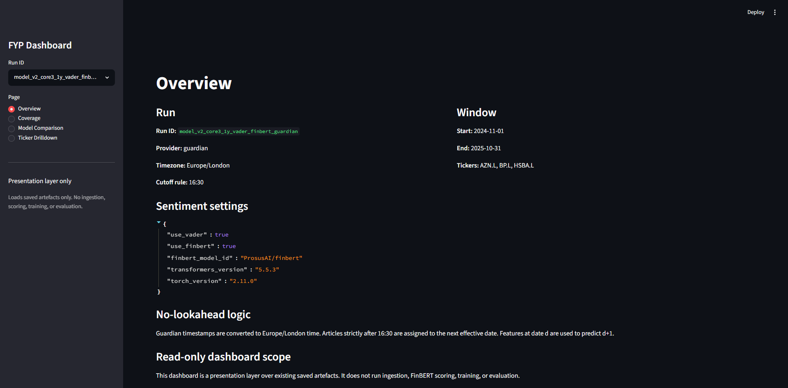
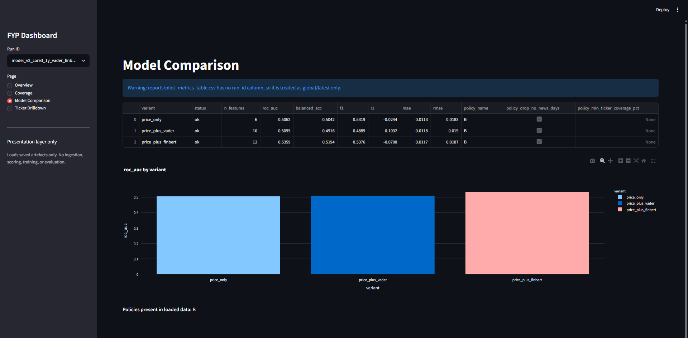
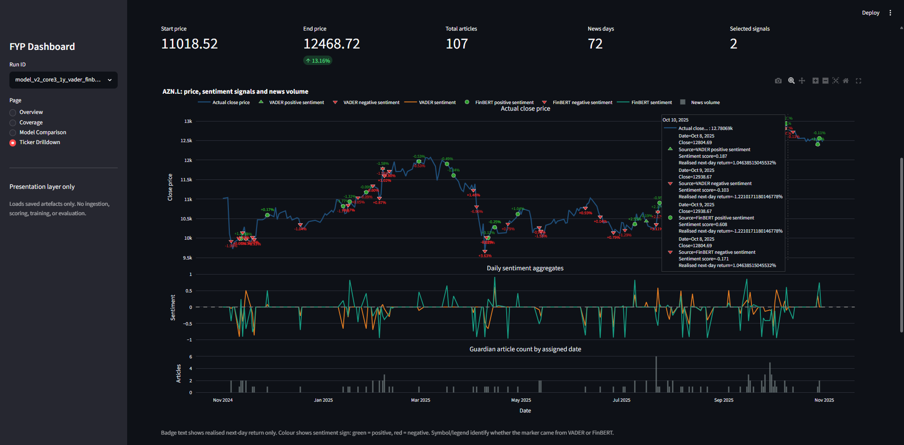

# UK News-Sentiment Pipeline for Short-Horizon Equity Movement

A reproducible Python pipeline comparing price-only features with VADER and FinBERT sentiment features for next-day UK equity movement analysis.

I built this as my Software Engineering Final Year Project. The aim was not to create a trading system, but to build a clear workflow for testing whether financial news sentiment adds useful signal over a simple price-only baseline.

The project combines daily market data, Guardian news metadata, timestamp-aware alignment, sentiment scoring, temporal evaluation, and a Streamlit dashboard for inspecting the saved outputs.

## What This Project Does

- Collects daily OHLCV price data with `yfinance`
- Retrieves time-stamped news metadata from The Guardian Open Platform
- Converts Guardian publication times to `Europe/London`
- Applies a 16:30 cutoff rule to reduce look-ahead risk
- Builds daily price and sentiment features
- Aligns features from day `t` with next-day movement at `t+1`
- Compares `price_only`, `price_plus_vader`, and `price_plus_finbert`
- Evaluates classification and regression performance with temporal holdout splits
- Provides a read-only Streamlit dashboard over saved artefacts

NewsAPI was explored early on, but the available access level was not suitable for repeated data collection. The final implemented news provider is The Guardian Open Platform.

## Study Scope

Final modelling window:

```text
2024-11-01 to 2025-10-31
```

The project first used an exploratory 8-ticker run to check Guardian coverage and retrieval quality. The final modelling subset is deliberately smaller:

```text
HSBA.L
BP.L
AZN.L
```

Final run:

```text
model_v2_core3_1y_vader_finbert_guardian
```

Coverage policies:

- Policy A keeps no-news days and represents them with `has_news` and `n_articles`.
- Policy B drops rows where no Guardian news was retrieved.

## Results

The results are mixed, which is important context for this project. Sentiment features show small differences in some classification metrics, but there is no strong evidence here of reliable market prediction. Regression performance is weak.

Policy A keeps no-news days:

| Variant | ROC-AUC | Balanced accuracy | F1 | R2 | MAE | RMSE |
| --- | ---: | ---: | ---: | ---: | ---: | ---: |
| price_only | 0.509 | 0.519 | 0.629 | -0.013 | 0.0096 | 0.0147 |
| price_plus_vader | 0.528 | 0.524 | 0.610 | -0.061 | 0.0098 | 0.0151 |
| price_plus_finbert | 0.512 | 0.489 | 0.553 | -0.040 | 0.0098 | 0.0149 |

Policy B drops no-news days:

| Variant | ROC-AUC | Balanced accuracy | F1 | R2 | MAE | RMSE |
| --- | ---: | ---: | ---: | ---: | ---: | ---: |
| price_only | 0.506 | 0.504 | 0.532 | -0.024 | 0.0113 | 0.0183 |
| price_plus_vader | 0.510 | 0.492 | 0.489 | -0.103 | 0.0118 | 0.0190 |
| price_plus_finbert | 0.536 | 0.519 | 0.538 | -0.071 | 0.0117 | 0.0187 |

My main takeaway is that the pipeline is more valuable than the small metric differences. It demonstrates how to collect data from real APIs, handle time alignment carefully, compare NLP methods, and report limitations honestly.

## Repository Structure

```text
app/        Streamlit dashboard and dashboard loading helpers
config/     YAML run configurations
docs/       Methodology, architecture, results, and data/privacy notes
reports/    Saved coverage and evaluation outputs
src/        Pipeline source code
tests/      Automated tests for cutoff and alignment logic
```

Generated data is not committed:

```text
data/raw/
data/processed/
```

This avoids publishing raw downloads, API-derived files, and local run outputs.

## Setup

Python 3.11 is recommended.

```powershell
python -m venv .venv
.\.venv\Scripts\Activate.ps1
python -m pip install --upgrade pip
pip install -r requirements.txt
```

For tests:

```powershell
pip install -r requirements-dev.txt
pytest -q
```

Guardian ingestion requires an API key:

```powershell
$env:GUARDIAN_API_KEY="your_guardian_key_here"
```

The real key is not included. Use `.env.example` as the template for local environment variables.

## Running The Pipeline

The final run can be reproduced with:

```powershell
python -m src.ingest.prices_yfinance --config config/model_core3_1y_vader_finbert_guardian.yaml
python -m src.ingest.news_guardian --config config/model_core3_1y_vader_finbert_guardian.yaml
python -m src.features.build_features_daily --config config/model_core3_1y_vader_finbert_guardian.yaml
python -m src.align.build_model_dataset --config config/model_core3_1y_vader_finbert_guardian.yaml
python -m src.reports.coverage_report --config config/model_core3_1y_vader_finbert_guardian.yaml
python -m src.inspection.build_inspection_items --config config/model_core3_1y_vader_finbert_guardian.yaml
python -m src.eval.pilot_metrics --config config/model_core3_1y_vader_finbert_guardian.yaml --policy A
python -m src.eval.pilot_metrics --config config/model_core3_1y_vader_finbert_guardian.yaml --policy B
```

FinBERT uses `transformers` and `torch`, so the news ingestion and scoring stage can take longer on first run.

## Dashboard

The Streamlit dashboard is a read-only inspection layer. It loads saved artefacts from `data/processed/` and `reports/`; it does not rerun ingestion, sentiment scoring, training, or evaluation.

```powershell
streamlit run app/app.py
```

Dashboard pages:

- Overview
- Coverage
- Model Comparison
- Ticker Drilldown

## Dashboard Preview

Overview:



Model comparison:



Ticker drilldown:



## Reproducibility Notes

The code and configs are designed to make the workflow repeatable, but the project depends on external data providers:

- `yfinance` data may change over time due to corrections or corporate actions.
- Guardian retrieval depends on API availability and access.
- FinBERT may download model files on first use.
- Raw and processed artefacts are excluded from GitHub.

## Limitations

- This is not a live trading system.
- The dashboard does not make buy/sell recommendations.
- Guardian keyword retrieval can be noisy and incomplete.
- The final modelling subset is small.
- The evaluation uses temporal holdout splits rather than a full walk-forward backtest.
- The regression results are weak and should not be described as market forecasting ability.

## Documentation

- [Methodology](docs/methodology.md)
- [Architecture](docs/architecture.md)
- [Results](docs/results.md)
- [Data and Privacy](docs/data-and-privacy.md)
- [Provider Decision Record](docs/provider-decision-record.md)
